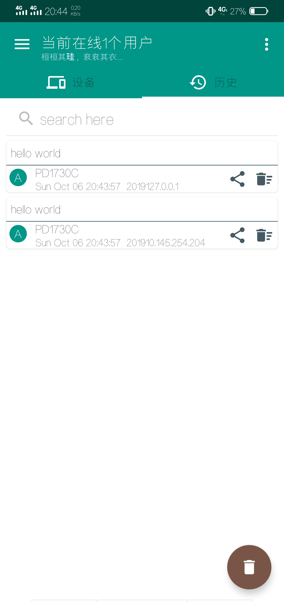
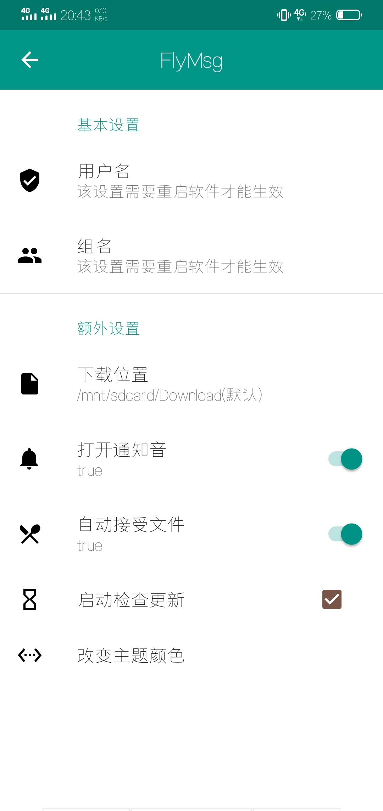

# Flymsg

局域网文件高速传输与即时通讯

## 简介
Flymsg(飞笺)是一个类飞鸽传书的局域网传输软件,具有即时通讯,局域网消息文件高速传输的功能,不受限于Internet连接且不消耗流量.该软件采用了开源ipmsg协议,因此理论上能于任何一个同样使用ipmsg协议的软件传输文件,比如能和飞鸽传书Linux,mac,ios,Android端软件任意连接与传输. \
那么为什么选择flymsg? \
1.界面美观.flymsg基于material design规范设计,具有良好的UI观感与用户体验 \
2.相应选项与设置全面.flymsg可以按照个人意愿设置 设备名称 工作组 下载位置  开启通知铃 修改主题颜色 等等. \
3.性能更好.使用了先进的开源库如速度更快的数据库与更迅捷的UI动画库 \
4.功能更完善.随意选择设备的文件,完整的下载进度提示,聊天界面交互与自由操作搜索聊天数据等等. \
5.更多的功能等待更新

## 截图

## 作者
lithiumice (LiangHuaLin) \
2729020028 (QQ) \
https://hualin.online (blog)

## 协议

>(c) 2019 LiangHuaLin

>这是一个免费软件: 你可以在由自由软件协会颁布的GUN通用公共协议的条件下重新分发或者修改

>这个软件出于它可能有用的考虑下发布, 但是没有任何服务义务与保障; 或者为了个人意图而做出修改. 请查看GUN通用公共协议得到更多信息.

>你应该收到一份GUN通用公共协议的拷贝在这个程序中,如果没有,请移步 <https://www.gnu.org/licenses/>.

## License

>(c) 2019 LiangHuaLin

>This is free software: you can redistribute it and/or modify it under the terms of the GNU General Public License as published by the Free Software Foundation, either version 3 of the License, or (at your option) any later version.

>This software is distributed in the hope that it will be useful, but WITHOUT ANY WARRANTY; without even the implied warranty of MERCHANTABILITY or FITNESS FOR A PARTICULAR PURPOSE. See the GNU General Public License for more details.

>You should have received a copy of the GNU General Public License along with this app. If not, see <https://www.gnu.org/licenses/>.
